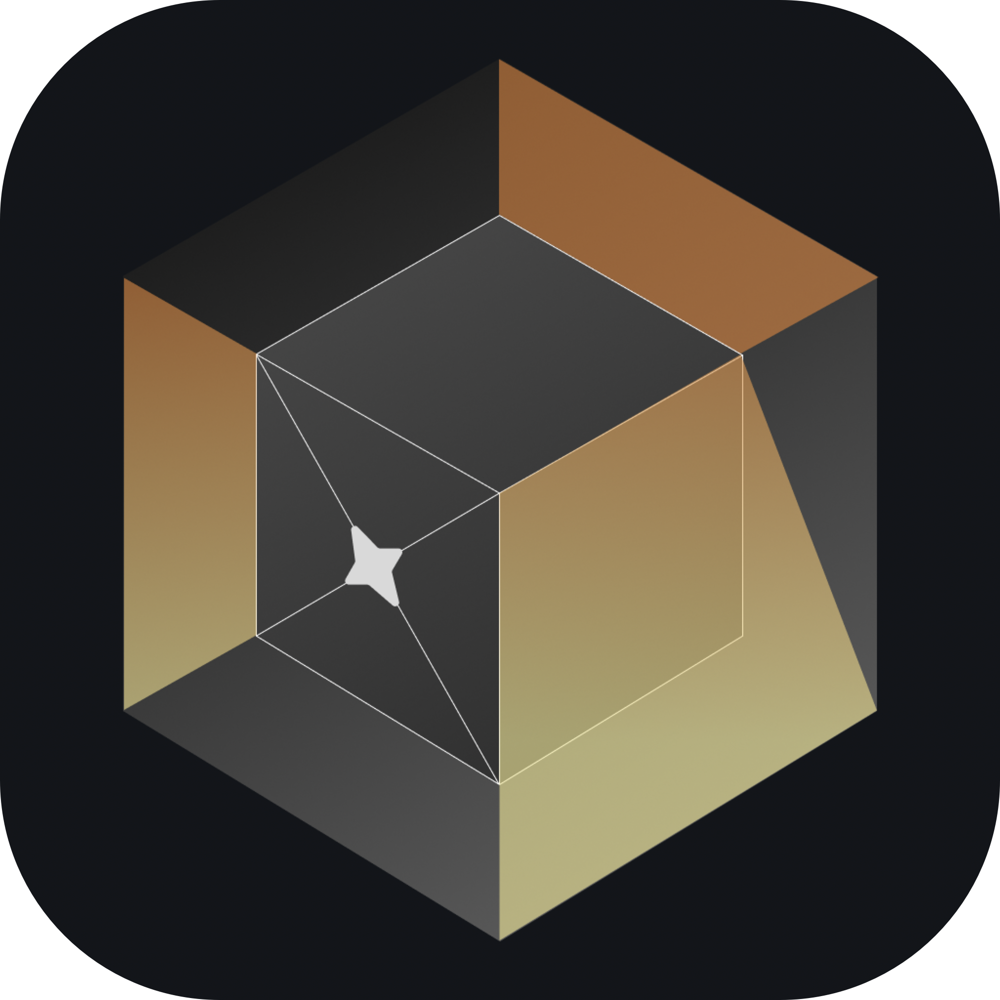

<p align="center">
  
</p>

<h1 align="center">Lumen</h1>

<p align="center">
  <strong>Browse. Remember. Ask. No cloud required.</strong>
</p>

<p align="center">
  
  
  
  
  
</p>

<p align="center">
  <a href="#how-it-works">How It Works</a> •
  <a href="#knowledge-system">Knowledge</a> •
  <a href="#privacy">Privacy</a> •
  <a href="#stack">Stack</a> •
  <a href="#building">Building</a>
</p>

---

An iOS browser built from scratch in SwiftUI. Lumen reads along with you — extracting, summarizing, and organizing every page you actually engage with into a personal knowledge base. Then you can ask questions about it, answered by a local LLM that never leaves your device.

<br/>

## How It Works

```
  You browse the web
         │
         ▼
┌─────────────────┐      reading signals detect
│   Lumen reads   │ ◀─── when you actually engage
│   along with    │      with a page, not just
│   you           │      open it
└────────┬────────┘
         │
         ▼
┌─────────────────┐      content extracted,
│  Knowledge DB   │ ◀─── embedded, summarized,
│  SQLite + FTS5  │      classified — all on-device
└────────┬────────┘
         │
    ┌────┴────┐
    ▼         ▼
 📂 Browse  ✦ Ask
 Topics →   "What did I
 Sites →     read about
 Pages       closures?"
```

All you have to do is browse. Lumen does the rest.

<br/>

## Knowledge System

The knowledge panel has two modes:

<table>
<tr>
<td width="50%">

### ✦ &nbsp;AI Chat

Ask questions in natural language. Lumen pulls relevant pages via semantic search, feeds them to a local Llama 3.2 1B model, and returns answers grounded in **your actual reading history** and not the whole internet.

Every answer cites its sources, so you can trace exactly where each response came from.

</td>
<td width="50%">

### 📂 &nbsp;Folders

Your reading auto-organizes into a hierarchy:

**Topics** → **Websites** → **Pages**

Each level gets its own LLM-generated summary. Topics are classified automatically. Websites get synthesis summaries built from your reading patterns across their pages.

</td>
</tr>
</table>

```
┌─────────────────────────────────────────┐
│  EVERYTHING RUNS ON-DEVICE              │
│                                         │
│  LLM inference    ████████  MLX Swift   │
│  Embeddings       ████████  NLEmbedding │
│  Full-text search ████████  FTS5        │
│  Vector search    ████████  Cosine sim  │
│  Storage          ████████  SQLite      │
│                                         │
│  No networking.                         │
└─────────────────────────────────────────┘
```

<br/>

## Privacy

Lumen has no server, meaning there's nothing to send.

| Layer              | Protection                                                            |
| ------------------ | --------------------------------------------------------------------- |
| **Network**        | HTTPS-only upgrades, mixed-content blocking                           |
| **Cookies**        | Third-party cookies blocked by default                                |
| **Tracking**       | Built-in tracker database with threat classification                  |
| **Fingerprinting** | Fingerprint resistance via content security policies                  |
| **Data**           | All knowledge stays in local SQLite — no sync, no cloud, no API calls |
| **AI**             | LLM runs on-device via MLX — prompts never leave your phone           |

<br/>

## Stack

```
Swift 6.2.4 · SwiftUI · iOS 17+
│
├── 🧠  MLX Swift ──────── on-device Llama 3.2 1B inference
├── 🌐  WKWebView ──────── hardened browser engine
├── 💾  SQLite + FTS5 ──── full-text search & content tables
├── 🔢  NLEmbedding ────── Apple's sentence-level embeddings
├── 🛡️  ThreatDetector ─── tracker & fingerprint classification
│
└── Zero external dependencies beyond Apple + MLX
```

<br/>

## Building

```bash
# clone
git clone https://github.com/Lux-Softworks/Lumen.git
cd Lumen

# open in Xcode 15+
open Lumen.xcodeproj

# run on physical device (⌘R)
```

<br/>

## License

[AGPL-3.0](LICENSE) — if you build on this, share it back.
