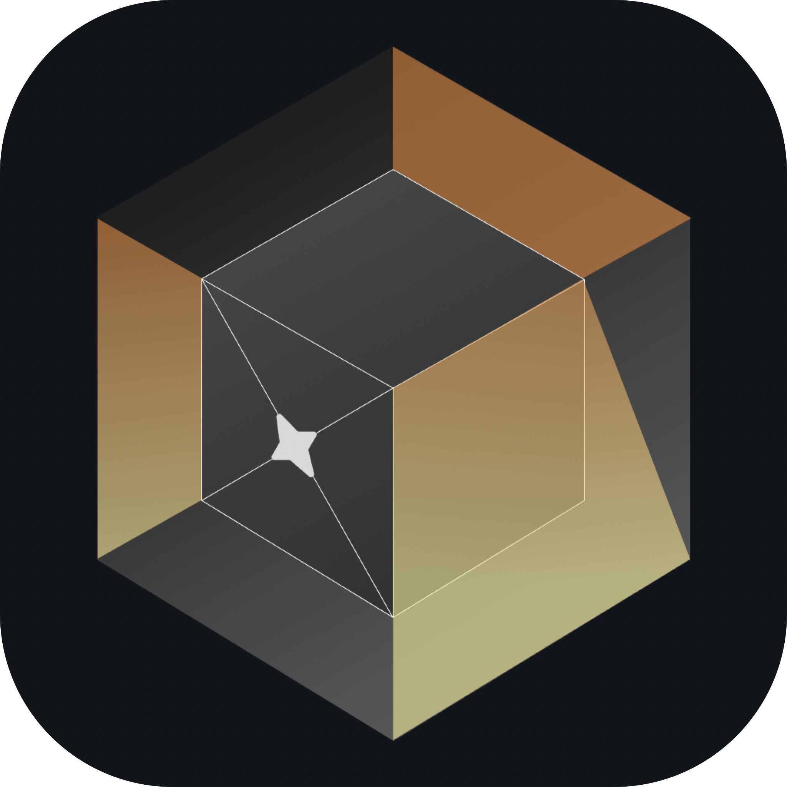
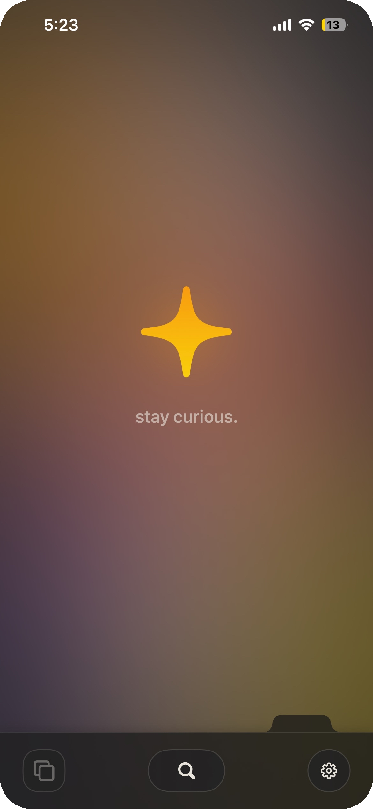
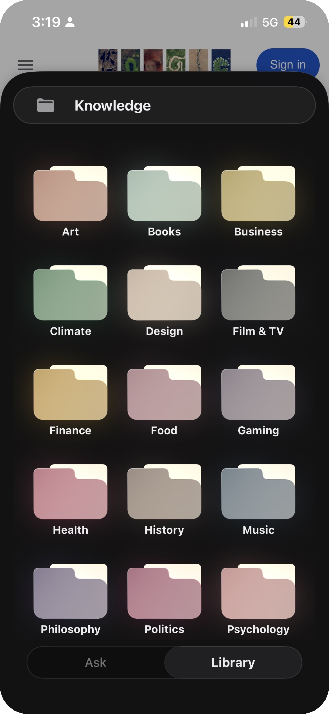
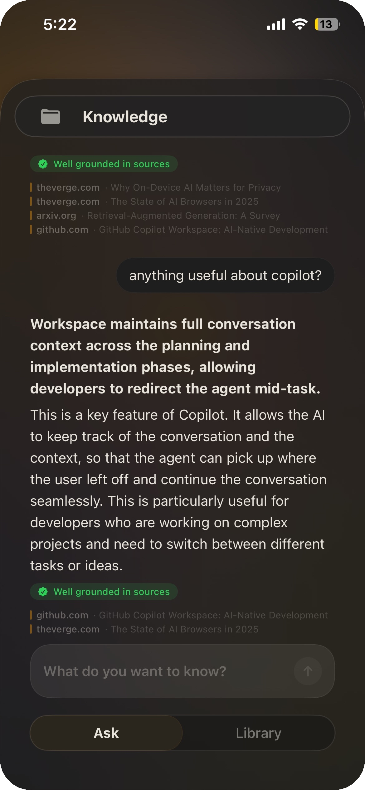
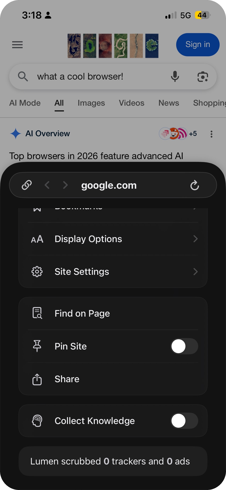

<p align="center">
  
</p>

<h1 align="center">Lumen</h1>

<p align="center">
  <strong>Browse. Remember. Ask. No cloud required.</strong>
</p>

<p align="center">
  
  
  
  
  
</p>

<p align="center">
  <a href="#demo">Demo</a> •
  <a href="#how-it-works">How It Works</a> •
  <a href="#knowledge-system">Knowledge</a> •
  <a href="#privacy">Privacy</a> •
  <a href="#stack">Stack</a> •
  <a href="#building">Building</a>
</p>

---

I kept reading great stuff online and then completely blanking on where I saw it, and so I built a browser that remembers for me.

Lumen reads along as you browse. It grabs the good parts of every page you actually spend time on, summarizing them, and filing them into a knowledge base that lives entirely on your phone. You can ask about any of it later. A local LLM answers from _your_ reading, not the whole internet, and it never calls any external services.

Runs on any iPhone or iPad on iOS 18+. No account, no server, no "sign in to continue." You browse like normal and it does the rest.

<br/>

## Demo

<p align="center">
  
  &nbsp;
  
  &nbsp;
  
  &nbsp;
  
</p>

<br/>

## How It Works

```
  You browse the web
         │
         ▼
┌─────────────────┐      reading signals detect
│   Lumen reads   │ ◀─── when you actually engage
│   along with    │      with a page, not just
│   you           │      open it
└────────┬────────┘
         │
         ▼
┌─────────────────┐      content extracted,
│  Knowledge DB   │ ◀─── embedded, summarized,
│  SQLite + FTS5  │      classified — all on-device
└────────┬────────┘
         │
    ┌────┴────┐
    ▼         ▼
 📂 Browse  ✦ Ask
 Topics →   "What did I
 Sites →     read about
 Pages       closures?"
```

<br/>

## Knowledge System

The knowledge system has two tabs:

<table>
<tr>
<td width="50%">

### ✦ &nbsp;AI Chat

Ask like you'd text a friend. Lumen finds the pages that matter, hands them to a local Llama 3.2 1B, and answers from **what you read online** instead of internet surfing.

Every answer shows its sources, so you can always check its validity.

</td>
<td width="50%">

### 📂 &nbsp;Folders

Everything you read sorts itself into folders:

**Topics** → **Websites** → **Pages**

Every layer writes its own little summary. Topics get sorted automatically, and each site gets a synthesis of everything you read there.

</td>
</tr>
</table>

```
┌─────────────────────────────────────────┐
│  EVERYTHING RUNS LOCALLY                │
│                                         │
│  LLM inference    ████████  MLX Swift   │
│  Embeddings       ████████  NLEmbedding │
│  Full-text search ████████  FTS5        │
│  Vector search    ████████  Cosine sim  │
│  Storage          ████████  SQLite      │
│                                         │
│  No networking.                         │
└─────────────────────────────────────────┘
```

<br/>

## Privacy

There's no server that we send anything to. That's kind of the whole point :)

| Layer              | Protection                                           |
| ------------------ | ---------------------------------------------------- |
| **Network**        | HTTPS-only upgrades, mixed-content blocking          |
| **Cookies**        | Third-party cookies blocked by default               |
| **Tracking**       | Built-in tracker database with threat classification |
| **Fingerprinting** | Fingerprint resistance via content security policies |
| **Data**           | All knowledge stays in local SQLite                  |
| **AI**             | LLM runs on-device via MLX                           |

<br/>

## Stack

```
Swift 6.2 · SwiftUI / iOS 18+ · Xcode 26.2+
│
├── 🧠  MLX Swift ──────── on-device Llama 3.2 1B inference
├── 🌐  WKWebView ──────── hardened browser engine
├── 💾  SQLite + FTS5 ──── full-text search & content tables
├── 🔢  NLEmbedding ────── Apple's sentence-level embeddings
├── 🛡️  ThreatDetector ─── tracker & fingerprint classification
│
└── Zero external dependencies beyond Apple + MLX
```

<br/>

## Building

### Requirements

- macOS with **Xcode 26.2** or newer
- **iOS 18** or newer device or simulator (Apple Silicon Mac required for the simulator)
- Apple Developer account for code signing
- Network access on first launch (the LLM weights are pulled from Hugging Face)

### Steps

```bash
# clone
git clone https://github.com/Lux-Softworks/Lumen.git
cd Lumen

# open in Xcode
open Lumen.xcodeproj
```

In Xcode:

1. Select the **Lumen** target → **Signing & Capabilities**.
2. Replace the bundled team (`XF6K537DNY`) with your own, and change the bundle identifier from `com.luxsoftworks.Lumen` to something unique to you (e.g. `com.yourname.Lumen`). Do the same for the `LumenTests` and `LumenUITests` targets.
3. Swift Package Manager will resolve the MLX Swift dependencies automatically on first open.
4. Pick a destination (iOS 18+ device or iOS 18+ simulator on Apple Silicon) and hit **⌘R**.

### First launch

The first time you open the knowledge panel, Lumen downloads the `mlx-community/Llama-3.2-1B-Instruct-4bit` weights (~700 MB) from Hugging Face and caches them on-device. After that, everything runs fully offline.

### Deployment

Lumen is a client-only iOS app. "Deploying" means getting the build onto a device:

- **Run on your own device** — connect an iPhone/iPad (iOS 18+), select it as the destination, and **⌘R**. Trust the developer profile under **Settings → General → VPN & Device Management** on first run.
- **Share via TestFlight** — in Xcode, **Product → Archive**, then distribute the archive to App Store Connect and invite testers through TestFlight.
- **App Store release** — submit the same archive for App Store review. Distribution through Apple's App Store is explicitly permitted by the license exception below.

<br/>

## License

[AGPL-3.0 with an Apple App Store distribution exception](LICENSE) — if you build on this, share it back.

The exception (added as additional permission under GNU AGPL version 3 section 7) authorizes distribution of this software through Apple's App Store under Apple's terms. All other distribution remains governed by the AGPL-3.0.

## Contributing

Want to help? Awesome — here's the process:

1. **Fork** the repository and create a feature branch off `main` (`git checkout -b your-feature`).
2. **Match the conventions** — read [`CLAUDE.md`](CLAUDE.md) for the project's code style. Most importantly: this codebase contains self-explanatory code (meaning no comments), and all building/testing happens **in Xcode** (build with ⌘R, run tests with ⌘U).
3. **Test on a physical device** for anything AI-related. The on-device LLM does not run in the Simulator.
4. **Open a pull request** against `main` with a clear description of what changed and why.

Thanks for helping improve our community and software!

## AI Declaration

Lumen was built entirely by me as a solo developer. I used AI tools (primarily Claude) throughout development for brainstorming architecture decisions, debugging, generating boilerplate, and writing code. All design decisions, system architecture, and feature direction are my own. I reviewed and understand every line of code in the project.
